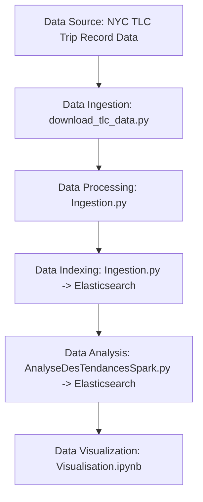

# NYC Taxi Data Analysis Project

## Description

Ce projet permet d'analyser les tendances du transport à New York en utilisant les données TLC des taxis jaunes. Il comprend plusieurs étapes :

- **Téléchargement** des données depuis le site officiel de la TLC.
- **Prétraitement** et nettoyage des données avec Pandas et Spark.
- **Stockage** des données dans Elasticsearch pour une analyse efficace.
- **Analyse** et génération de statistiques agrégées avec Apache Spark.
- **Visualisation** des résultats avec Kibana.

## Prérequis

Avant d'exécuter ce projet, assure-toi d'avoir installé les outils suivants :

- Python 3.x
- Apache Spark
- Elasticsearch (avec Kibana pour la visualisation)
- Les bibliothèques Python nécessaires :
  ```sh
  pip install pandas geopandas elasticsearch tqdm requests beautifulsoup4 pyspark
  ```

## Structure du projet

```
BIG/
│── data/
│   ├── taxi_zones/
│   │   ├── taxi_zone_lookup.csv
│   │   ├── taxi_zones.shp
│   │
│   ├── tlc_data/
│   │   ├── yellow_tripdata_2019-01.parquet
│
│── _Ingestion.py
│── _AnalyseDesTendancesSpark.py
│── _Visualisation.ipynb
│── download_tlc_data.py
```

## Pipeline de traitement des données

(images/diagramme.png)



## Étapes d'exécution

### 1. Télécharger les données TLC

Lance le script suivant pour récupérer les fichiers `yellow_tripdata` nécessaires :

```sh
python download_tlc_data.py
```

### 2. Ingestion des données dans Elasticsearch

Exécute le script d'ingestion pour charger les données nettoyées dans Elasticsearch :

```sh
python _Ingestion.py
```

### 3. Analyse des tendances avec Spark

Lance le script Spark pour générer des statistiques sur les données :

```sh
spark-submit --packages org.elasticsearch:elasticsearch-spark-30_2.12:8.11.4 _AnalyseDesTendancesSpark.py
```

### 4. Visualisation avec Kibana

Une fois les données indexées, utilise Kibana pour explorer les tendances en créant des dashboards.

Les données analysées sont visualisées avec Vega-Lite dans Kibana. Voici quelques indicateurs clés affichés :

- **Revenu Total ($)** : Affichage du revenu total généré par les taxis.
- **Nombre Total de Courses** : Nombre total de trajets effectués.
- **Tarif Moyen** : Montant moyen facturé par course.
- **Distance Moyenne (mi)** : Distance moyenne parcourue par course.
- **Répartition des Revenus par Mode de Paiement** : Histogramme du revenu selon les modes de paiement (carte, cash, etc.).
- **Revenu par Nombre de Passagers** : Comparaison du revenu en fonction du nombre de passagers.
- **Revenu par Type de Tarif** : Répartition des revenus selon le type de tarif (standard, JFK, Newark, etc.).
- **Nombre de Courses par Heure** : Histogramme des courses en fonction de l'heure de la journée.

Ces visualisations permettent d'identifier les tendances de transport et d'optimiser les services de taxi en fonction des comportements des passagers.

(images/TableauDeBord.jpeg)

## Fonctionnalités principales

- **Nettoyage des données** : Filtrage des distances aberrantes et suppression des zones invalides.
- **Ajout des coordonnées GPS** aux données à partir des fichiers `shp`.
- **Stockage structuré** dans Elasticsearch avec mappings adaptés.
- **Calcul de statistiques avancées** sur les revenus, distances, heures de pointe, types de paiement, etc.

## Auteur

Boumediene Khachache

